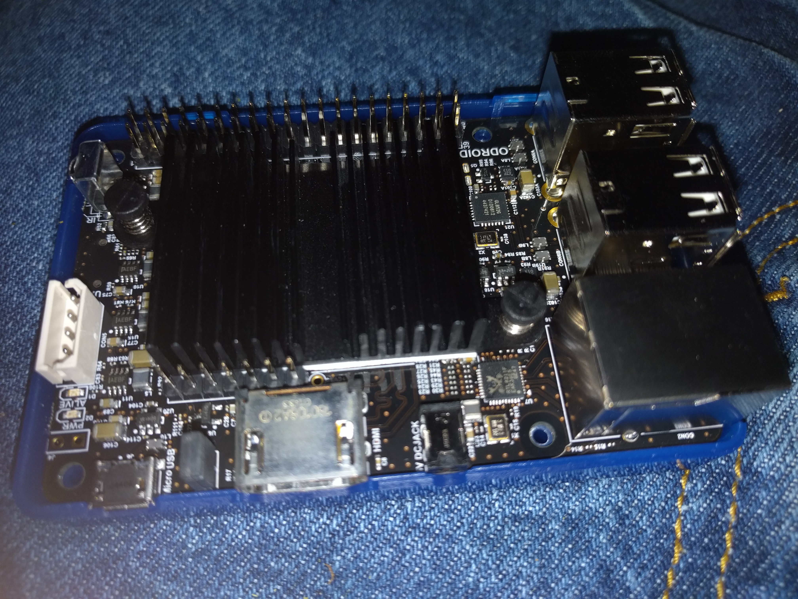

Title: Odroid C2
Date: 2016-03-24 23:05
Slug: odroid-c2
Authors: Reese
Summary: Hardkernels new Odroid-C2

<h1>Part One</h1>

I have not installed a OS yet on this new machine. You can look at the specs [here](http://www.hardkernel.com/main/products/prdt_info.php) I guess I'll start out with Ubuntu since is the offical supported one. I have not seen any images for any of the BSD's yet. I plan on using all 8 of my cores to build the image. Have only done this in the BSDs so far. This will be interesting. I installed with OpenSSH and Samba and Automatic Updates services enabled. I have not used Landscape *yet*. If you have read this far checkout a photo . 
